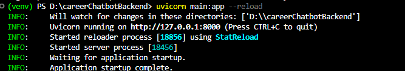
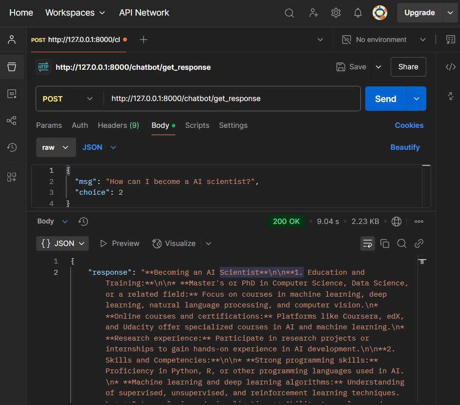

# Career Chatbot Backend

A **FastAPI** application that uses **Tavily** (search engine) and **Gemini** (Google Generative AI) to answer user questions. This chatbot classifies and processes queries, optionally performing PDF-based embeddings and similarity searches for more detailed answers.

---

## Features

1. **Tavily Integration**  
   - Searches real-time information or recent events.  
   - Uses `langchain_community` tools to invoke Tavily’s API.

2. **Gemini (Google Generative AI)**  
   - Provides classification and response generation.  
   - Supports PDF-based vector searches before generating an answer.

3. **FastAPI REST Endpoints**  
   - Exposes a single `/chatbot/get_response` endpoint for sending user prompts.  
   - Returns JSON responses with classification, Tavily search results, and AI-generated text.

4. **PDF Knowledge (Optional)**  
   - Demonstrates how to load a PDF with `PyPDFLoader`, embed it, and search for relevant pages.

---

## Step-by-Step Setup

### 1. Clone or Download the Project

```bash
git clone https://github.com/YourUsername/careerChatbotBackend.git
cd careerChatbotBackend
```

### 2. Create and Activate a Virtual Environment 
```bash
# Windows:
python -m venv venv
venv\Scripts\activate
```

```bash
# macOS/Linux:
python -m venv venv
source venv/bin/activate
```

### 3. Install Dependencies
```bash
pip install -r requirements.txt
```

### 4. Environment Variables
```.env
TAVILY_API_KEY = tvly-XXXXXXXXXXXX
GOOGLE_API_KEY = AIzaSyXXXXXXXXXXXX
```

### 5. Run the FastAPI Server
```bash
uvicorn main:app --reload
```
**Successful Run:** 



### 6. Test API
#### Method 1: Using Postman:
1. **POST** to http://localhost:8000/chatbot/get_response
2. Set **Body** to **raw** JSON
```json
    {
    "msg": "How can I become a AI Scientist?",
    "choice": 2
    }
```
3. Example Response:
```json
{
    "response": "**Becoming an AI Scientist**\n\n**1. Education and Training:**\n\n* **Master's or PhD in Computer Science, Data Science, or a related field:** Focus on courses in machine learning, deep learning, natural language processing, and computer vision.\n* **Online courses and certifications:** Platforms like Coursera, edX, and Udacity offer specialized courses in AI and machine learning.\n* **Research experience:** Participate in research projects or internships to gain hands-on experience in AI development.\n\n**2. Skills and Competencies:**\n\n* **Strong programming skills:** Proficiency in Python, R, or other programming languages used in AI.\n* **Machine learning and deep learning algorithms:** Understanding of supervised, unsupervised, and reinforcement learning techniques.\n* **Data analysis and visualization:** Ability to analyze and interpret large datasets.\n* **Cloud computing:** Familiarity with cloud platforms like AWS, Azure, or GCP.\n* **Communication and teamwork:** Ability to collaborate effectively with engineers, scientists, and business stakeholders.\n\n**3. Career Path:**\n\n* **Junior AI Engineer:** Entry-level role involving data preparation, model development, and testing.\n* **AI Scientist:** Develop and implement AI solutions for specific business problems.\n* **Senior AI Scientist:** Lead AI projects and mentor junior team members.\n* **AI Research Scientist:** Conduct cutting-edge research in AI and machine learning.\n\n**4. Resources and Strategies:**\n\n* **Attend industry conferences and workshops:** Network with professionals and learn about the latest advancements in AI.\n* **Join professional organizations:** Become a member of organizations like the Association for the Advancement of Artificial Intelligence (AAAI) or the IEEE Computer Society.\n* **Build a portfolio:** Showcase your AI projects and research on platforms like GitHub or Kaggle.\n* **Seek mentorship:** Find an experienced AI scientist who can provide guidance and support.\n* **Stay updated:** Continuously learn about new AI techniques and technologies through online courses, research papers, and industry blogs."
}
```
